# portfolio-Docker-aws
Personal portfolio website containerized with Docker, served with Nginx, and deployed on AWS EC2.
Personal Portfolio Deployment on AWS with Docker & Nginx

This repository contains the complete setup and deployment process of **my personal portfolio website**.  
The site was fully containerized using **Docker**, served using **Nginx**, and deployed on an **AWS EC2 instance** for global access.

### Architecture Diagram

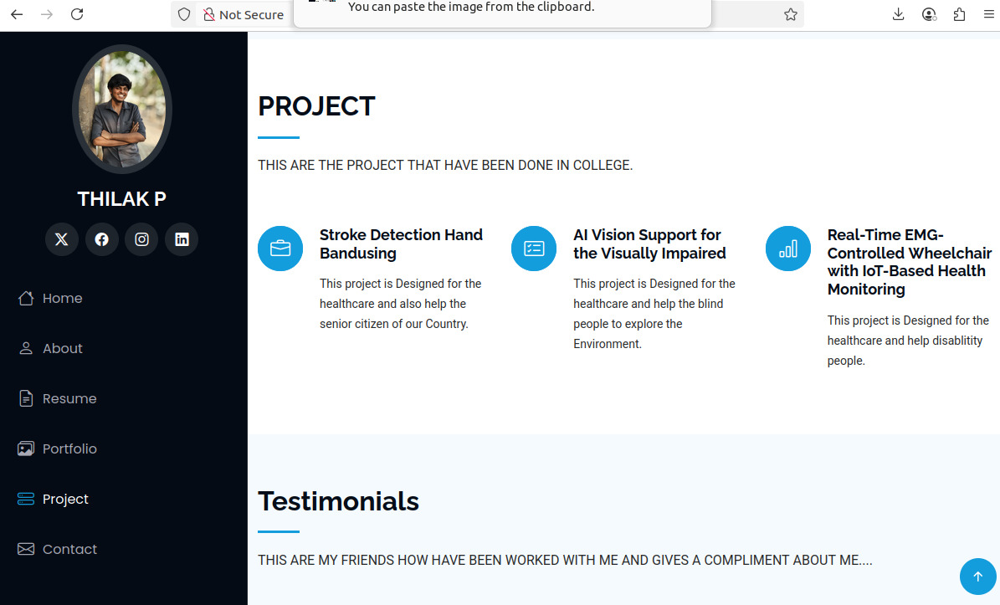

---

## 🛠️ Technologies Used
- HTML & CSS – Frontend development  
- Docker – Containerization  
- Nginx – Web server  
- AWS EC2 (Linux) – Cloud hosting  
- Git & GitHub – Version control  

---

---

## ⚙️ Dockerfile Explanation
The Dockerfile performs the following actions:
- Uses the official Nginx base image  
- Copies static website files into the Nginx default directory  
- Exposes port 80 for web access  

---

## 🧪 Deployment Process (With Screenshots)

### 1️⃣ Docker Installation on AWS EC2
Docker was installed on a Linux-based EC2 instance.

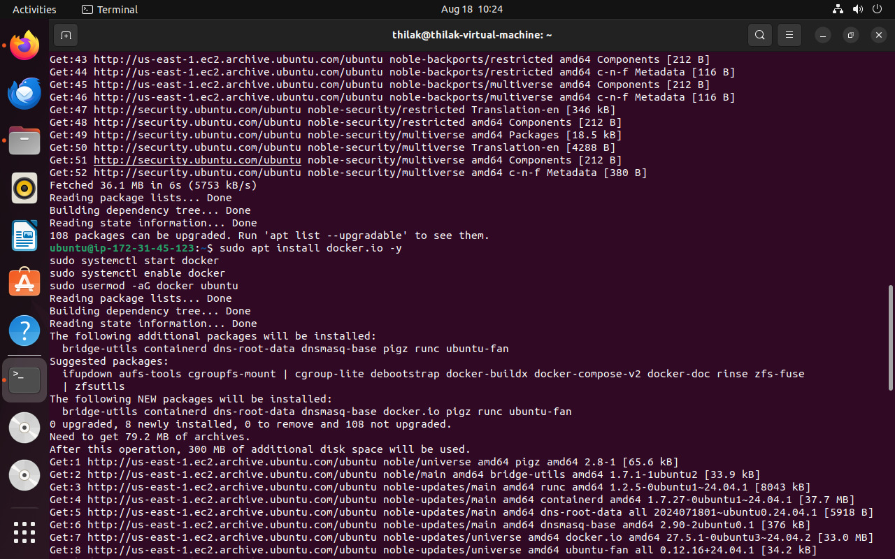

---

### 2️⃣ Clone GitHub Repository
The project repository was cloned into the EC2 instance.

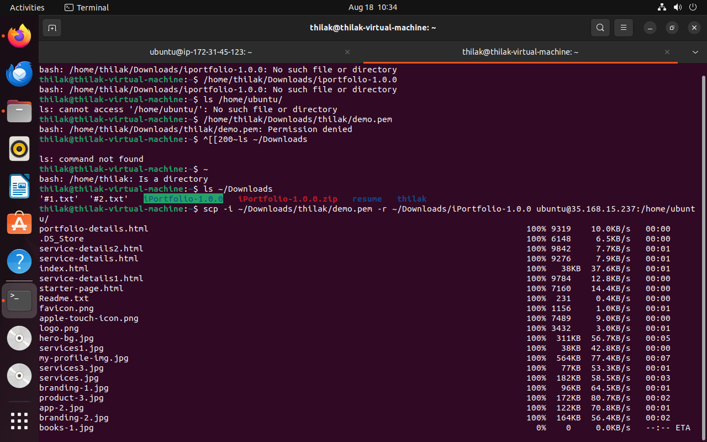

---

### 3️⃣ Build Docker Image
The Docker image was built using the Dockerfile.

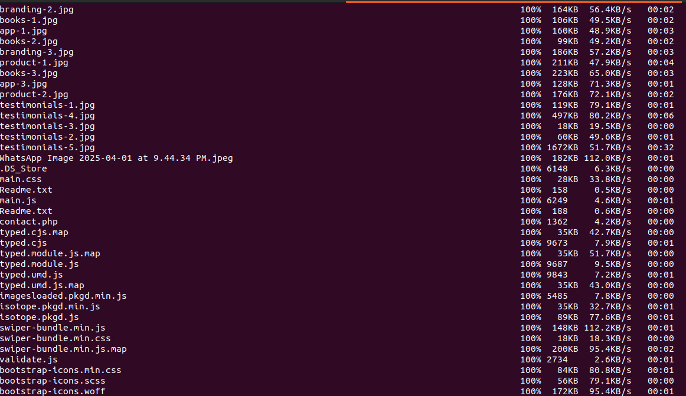

---

### 4️⃣ Verify Docker Image
The Docker image was verified successfully.

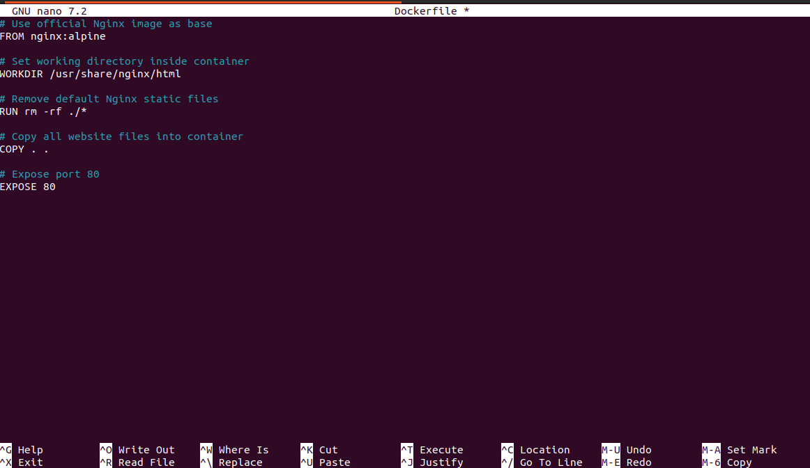

---

### 5️⃣ Run Docker Container
The Docker container was started by mapping port 80 of the EC2 instance.

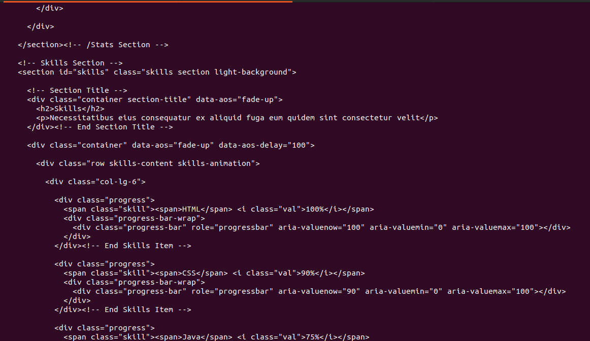
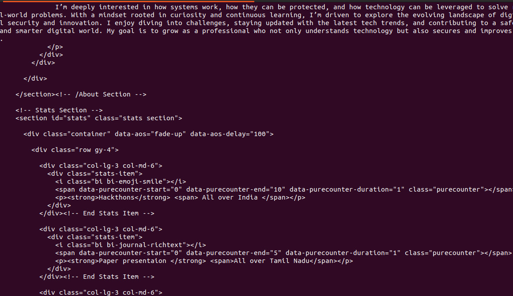
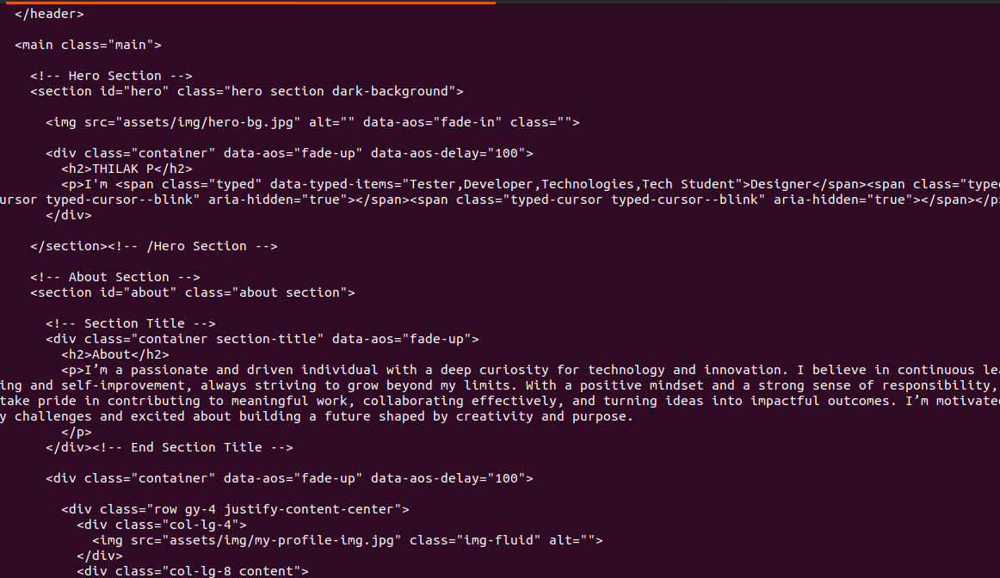

---

### 6️⃣ SSH Access to EC2
Secure SSH connection to manage the EC2 instance.

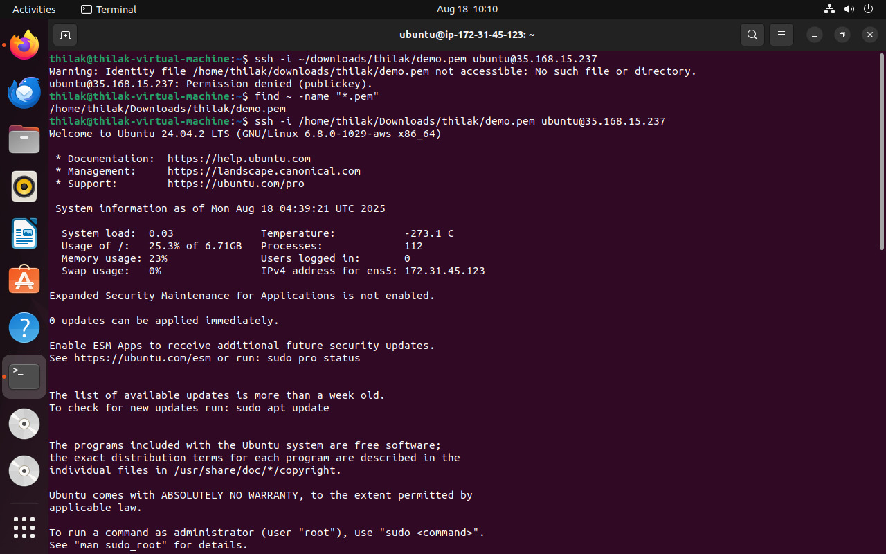

---

### 7️⃣ Access Website Using Public IP
The portfolio website was accessed using the EC2 public IP address.


---

## 🌍 Portfolio Website Screenshots

### Portfolio Pages

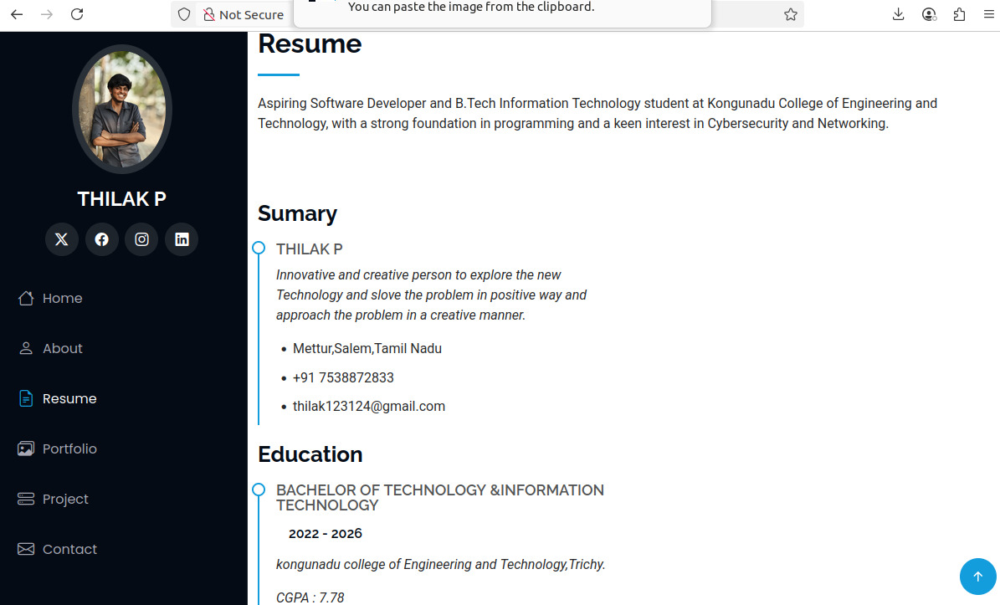
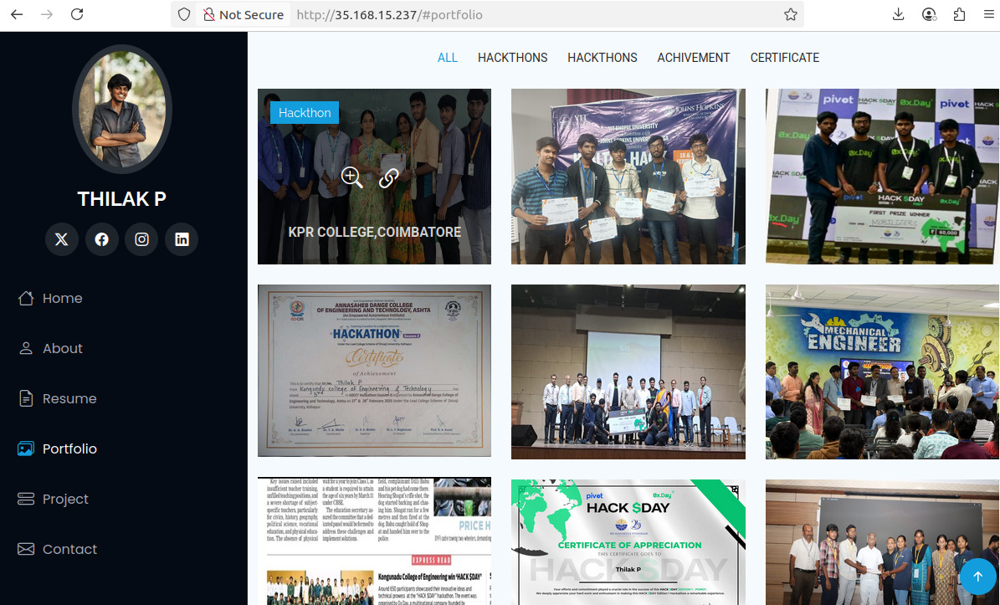
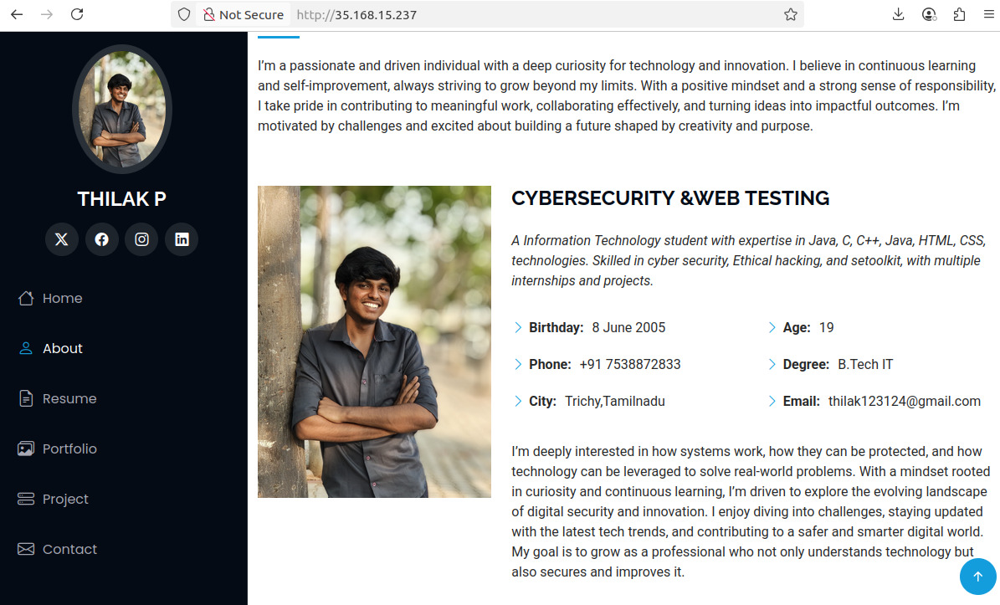
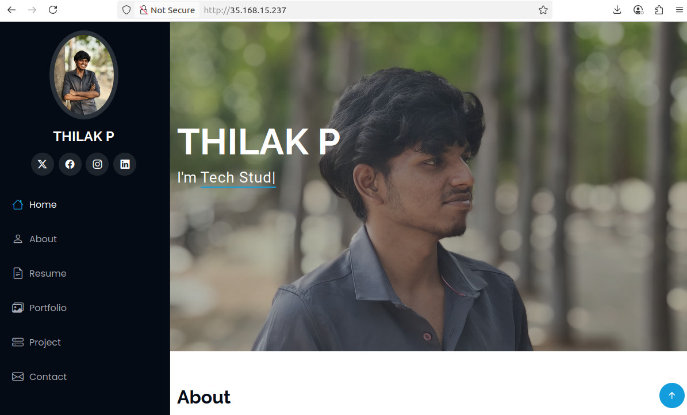

---

---

## 💡 Interview Explanation
"I containerized my personal portfolio using Docker, served it with Nginx, and deployed it on an AWS EC2 instance. I built the Docker image, ran the container by exposing port 80, and accessed the website through the EC2 public IP."


## ⚙️ Steps to Deploy

### Clone this repository 
```bash
git clone https://github.com/Thilak-2005/portfolio-docker-aws.git
cd portfolio-docker-aws
```
----
### Build the Docker image  
```bash
docker build -t my-portfolio .
```
----
### Run the container
```bash
docker run -d -p 80:80 my-portfolio
```

### Access the portfolio
```bash
Open your browser → http://<your-ec2-public-ip>
